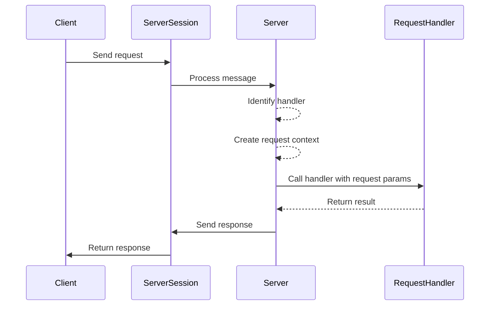
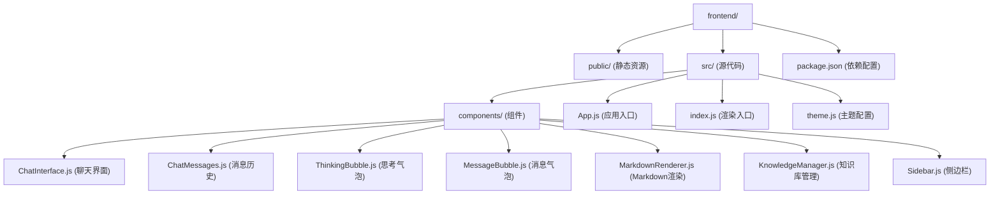
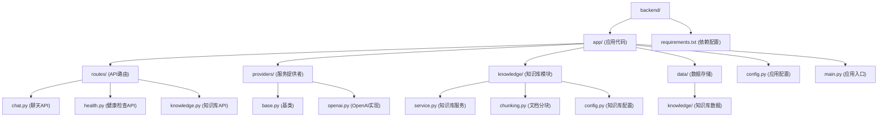
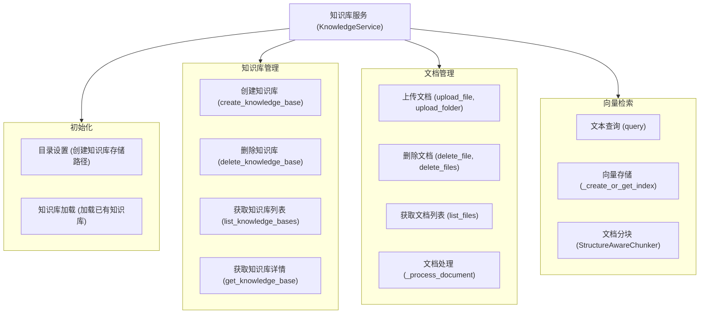
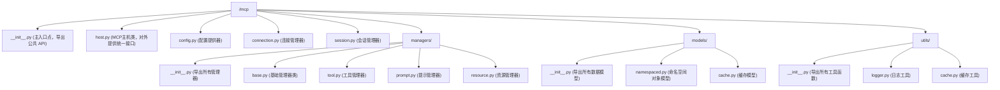

# AI聊天应用模板

一个功能完整的AI聊天应用模板，支持流式响应、思考状态展示和多轮对话记忆，可用于快速构建各类AI助手应用。

## 功能特点

- ✨ 现代化的UI界面，响应式设计
- 🔄 流式响应，实时显示AI回复
- 💭 思考状态展示，直观呈现AI思考过程
- 📝 多轮对话记忆功能
- 📚 知识库管理，支持文档上传与语义检索
- 🧩 模块化设计，易于扩展
- 🌐 可作为各类AI应用的起点

## 技术栈

### 前端
- React.js
- Styled Components
- React Icons
- Markdown渲染

### 后端
- Python
- FastAPI
- 异步流处理
- OpenAI/自定义LLM适配器

## 项目结构

```
ai-template/
├── frontend/                # 前端React应用
│   ├── public/              # 静态资源
│   └── src/                 # 源代码
│       ├── components/      # 组件
│       └── styles/          # 样式
└── backend/                 # Python后端应用
    ├── app/                 # 应用代码
    │   ├── main.py          # FastAPI 入口
    │   ├── config.py        # 配置项
    │   ├── routes           # 路由
    │   └── providers/       # LLM服务提供者
    └── requirements.txt     # Python依赖
```

## 组件说明

### 前端主要组件

- **ChatInterface**: 聊天界面主组件，处理消息发送和接收
- **ChatMessages**: 显示消息历史
- **ThinkingBubble**: 思考气泡组件，显示AI思考过程
- **MessageBubble**: 消息气泡组件
- **MarkdownRenderer**: Markdown内容渲染器
- **KnowledgeManager**: 知识库管理组件，支持文档上传与管理
- **Sidebar**: 侧边栏导航

### 后端主要模块

- **app/main.py**: FastAPI应用入口
- **app/routes/**: API路由定义
- **app/providers/**: LLM服务提供者实现
- **app/knowledge/**: 知识库管理服务模块

## 快速开始

### 前置条件

- Python >= 3.11
- Node.js >= 18.0.0
- npm 或 yarn

### 安装步骤

1. 克隆仓库
```bash
git clone https://github.com/yourusername/ai-template.git
cd ai-template
```

2. 安装前端依赖
```bash
cd frontend
npm install
```

3. 安装后端依赖
```bash
cd ../backend
python -m venv venv
source venv/bin/activate  # Windows: venv\Scripts\activate
pip install -r requirements.txt
```

4. 配置环境变量
```bash
# 在backend目录创建.env文件
cp .env.example .env  # 然后编辑.env文件
```

添加以下内容到.env文件：
```
API秘钥
DEEPSEEK_API_KEY=your_api_key_here
DEEPSEEK_API_URL=https://api.deepseek.com/
```

5. 启动开发服务器

前端：
```bash
cd frontend
npm start
```

后端：
```bash
cd backend
uvicorn app.main:app --reload
```

6. 访问应用
浏览器打开 [http://localhost:3000](http://localhost:3000)

## 使用指南

### 基本对话
- 在输入框中输入消息并发送
- AI会开始思考，显示思考状态
- 回复会以流式方式显示

### 使用知识库
- 在知识库管理页面创建新的知识库
- 上传文档（支持PDF、TXT等格式）
- 使用知识库进行对话查询
- 对话中引用相关知识源

### 移动端使用
- 界面已适配移动设备
- 触摸滚动优化
- 响应式布局

## 扩展指南

### 添加新的LLM提供者
1. 在`backend/app/providers`目录下创建新提供者文件
2. 实现BaseProvider接口
3. 在配置中启用新提供者

### 自定义界面
- 修改`frontend/src/styles/GlobalStyles.js`调整全局样式
- 调整组件样式可编辑相应的样式定义

## 问题解决

### 常见问题

1. **API连接错误**
   - 检查API密钥配置
   - 确认网络连接正常

2. **样式显示问题**
   - 检查GlobalStyles是否正确导入
   - 确认样式变量定义

## 贡献指南

欢迎提交PR改进这个模板。请确保：
1. 代码风格一致
2. 添加适当的注释
3. 更新相关文档

## 许可证

MIT

---

## 系统架构图

### 服务端架构图

```mermaid
graph TD
    ClientApps[Client Applications] -->|Connects via| TransportLayer[Transport Layer]

    subgraph TransportOptions [Transport Layer]
        direction TB
        subgraph Mechanisms [Transport Mechanisms]
            direction LR
            TM_WS[WebSocket]
            TM_STDIO[STDIO]
            TM_HTTP_SSE[HTTP/SSE]
        end
        
        subgraph Endpoints [Server Endpoints]
            EP_WS[websocket_server]
            EP_STDIO[stdio_server]
            EP_SSE[SseServerTransport]
        end

        TM_WS --> EP_WS
        TM_STDIO --> EP_STDIO
        TM_HTTP_SSE --> EP_SSE
    end
    TransportLayer --> Mechanisms


    ServerSession[ServerSession]
    EP_WS --> ServerSession
    EP_STDIO --> ServerSession
    EP_SSE --> ServerSession

    LowLevelServer[Server (low-level)]
    ServerSession -->|Communicates with| LowLevelServer

    subgraph ServerInternalLogic [Server Internal Logic and Components]
        RequestHandlers[Request Handlers]
        NotificationHandlers[Notification Handlers]
        ToolManager[ToolManager]
        ResourceManager[ResourceManager]
        PromptManager[PromptManager]
        FastMCP[FastMCP]
        RequestContext[RequestContext]

        LowLevelServer -->|Dispatches to| RequestHandlers
        LowLevelServer -->|Dispatches to| NotificationHandlers
        
        LowLevelServer -->|Delegates to| ToolManager
        LowLevelServer -->|Delegates to| ResourceManager
        LowLevelServer -->|Delegates to| PromptManager

        FastMCP -->|Manages| ToolManager
        FastMCP -->|Manages| ResourceManager
        FastMCP -->|Manages| PromptManager
        
        LowLevelServer -.->|Creates/Uses for Handlers| RequestContext
        ResourceManager -->|Uses| RequestContext
    end
```

### 请求处理流程图



## 版本历史

- **v1.1.0** - 添加知识库管理功能，支持文档上传与语义检索
- **v1.0.0** - 初始版本，包含基本聊天功能和思考状态

## 代码架构

### 前端结构


### 后端整体架构
```mermaid
graph TD
    subgraph Client [Client Application]
        HTTPRequest[HTTP Request]
    end

    subgraph BackendApp [Backend FastAPI Application]
        direction LR
        FastAPI_App["FastAPI App (main.py)"]

        subgraph CoreComponents [Core FastAPI & App Components]
            direction TB
            Middleware["Middleware (CORS, Error Handling)"]
            DepInjection["Dependency Injection"]
            AppConfig["App Configuration (core/config.py)"]
        end
        
        APIRouter_Main["Main API Router (api/__init__.py)"]

        FastAPI_App --> Middleware
        FastAPI_App --> DepInjection
        FastAPI_App --> AppConfig
        FastAPI_App --> APIRouter_Main
        
        subgraph ModuleRouters [API Module Routers (api/routes/)]
            direction TB
            ChatRouter["Chat Router (chat.py)"]
            KnowledgeRouter["Knowledge Router (knowledge.py)"]
            MCPRouter["MCP Router (mcp.py)"]
        end
        APIRouter_Main --> ModuleRouters

        subgraph Services [Application Services (services/)]
            direction TB
            ChatService_S["ChatService (chat.py)"]
            KnowledgeService_S["KnowledgeService (knowledge.py)"]
            MCPService_S["MCPService (mcp.py)"]
        end
        
        ChatRouter --> ChatService_S
        KnowledgeRouter --> KnowledgeService_S
        MCPRouter --> MCPService_S

        subgraph Libraries [Libraries & Data (lib/, data/)]
            direction TB
            LLMProviders["LLM Providers (lib/providers/)"]
            KnowledgeLib["Knowledge Lib (lib/knowledge/)"]
            MCPLib["MCP Lib (lib/mcp/)"]
            KnowledgeDataStore["Knowledge Data (data/knowledge/)"]
        end

        ChatService_S --> LLMProviders
        KnowledgeService_S --> KnowledgeLib
        KnowledgeService_S --> KnowledgeDataStore
        MCPService_S --> MCPLib
        
        AppConfig --> Services
        AppConfig --> Libraries
    end
    
    HTTPRequest --> FastAPI_App
```

### 后端文件结构


### 知识库架构


### mcp架构

