# AI Template 项目架构设计文档

## 📋 目录
1. [项目概览](#项目概览)
2. [核心设计理念](#核心设计理念)
3. [系统架构图](#系统架构图)
4. [技术栈架构](#技术栈架构)
5. [核心功能模块](#核心功能模块)
6. [数据流向分析](#数据流向分析)
7. [部署架构](#部署架构)
8. [扩展性设计](#扩展性设计)

## 🎯 项目概览

### 项目定位
AI Template 是一个现代化的**智能对话平台**，集成了多种AI能力，为用户提供强大的AI助手服务。

### 核心特性
- 🤖 **多Provider LLM支持**：支持OpenAI、Claude、本地模型等多种LLM服务
- 🔧 **MCP工具集成**：通过Model Context Protocol集成外部工具和服务
- 📚 **知识库增强**：RAG技术支持的智能知识检索
- 🌐 **网络搜索**：实时网络信息获取能力
- 💬 **流式对话**：实时响应的对话体验
- 👥 **多用户支持**：完整的用户管理和权限控制
- 🔒 **安全可靠**：JWT认证、数据隔离、API密钥安全管理

### 技术亮点
- **ReAct模式**：Reasoning + Acting的智能体架构
- **异步优先**：全异步设计，高并发性能
- **微服务架构**：模块化设计，易于扩展
- **实时流式**：WebSocket + SSE双重流式支持

## 🏗️ 核心设计理念

### 1. 智能体优先架构
**设计目标：** 构建真正的AI智能体，而非简单的聊天机器人

**核心特性：**
- ✅ **工具调用能力**：通过MCP协议集成各种外部工具
- ✅ **推理能力**：ReAct模式的思考-行动循环
- ✅ **记忆能力**：上下文管理和会话历史
- ✅ **学习能力**：知识库集成和动态学习

### 2. 用户中心设计
**设计原则：** 每个用户拥有独立的AI配置和数据空间

**实现策略：**
- 独立的LLM Provider配置
- 隔离的MCP服务器实例
- 私有的知识库和对话历史
- 个性化的AI助手设置

### 3. 可扩展架构
**架构分层：**
- **表现层**：React前端，响应式设计
- **接口层**：FastAPI，RESTful + 流式API
- **业务层**：服务类，业务逻辑封装
- **数据层**：MySQL，结构化数据存储
- **集成层**：MCP、LLM Provider、知识库集成

## 🔄 系统架构图

### 1. 整体系统架构
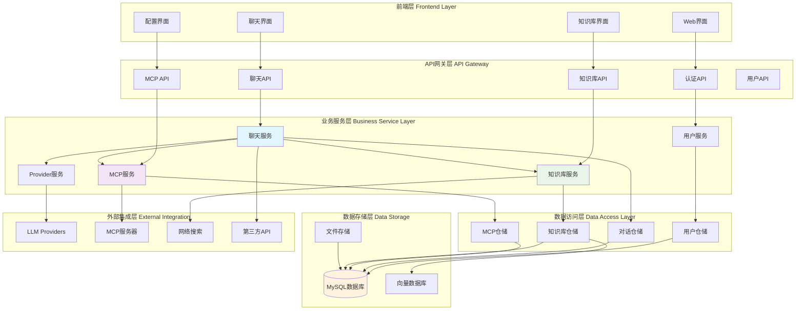

### 2. 聊天服务核心流程
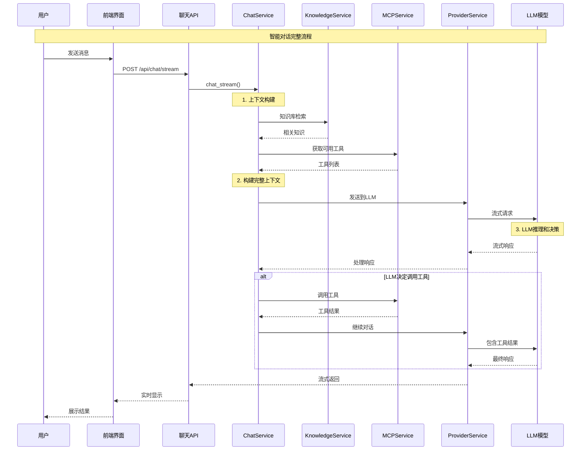

### 3. MCP服务架构流程
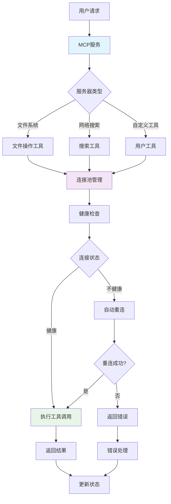

### 4. 知识库RAG流程
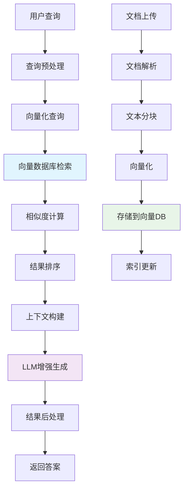

## 🛠️ 技术栈架构

### 前端技术栈
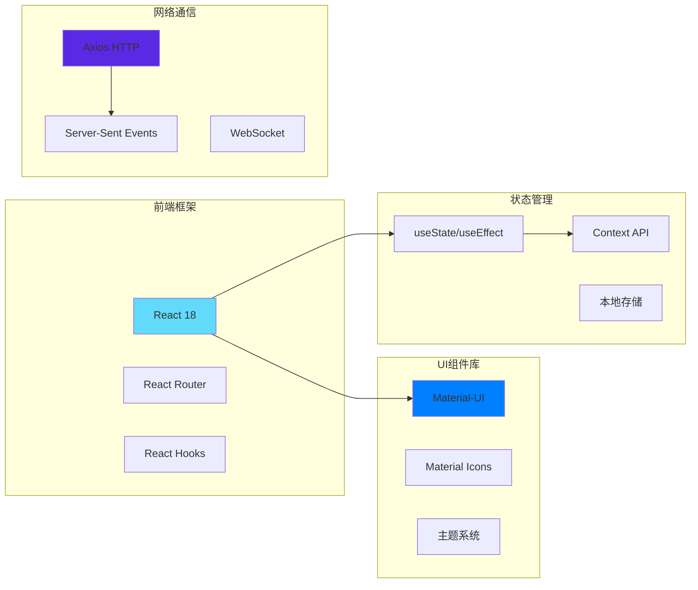

### 后端技术栈
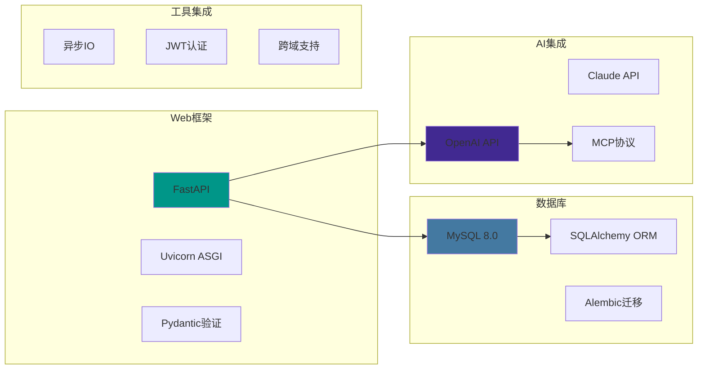

## 🎛️ 核心功能模块

### 1. 用户管理模块
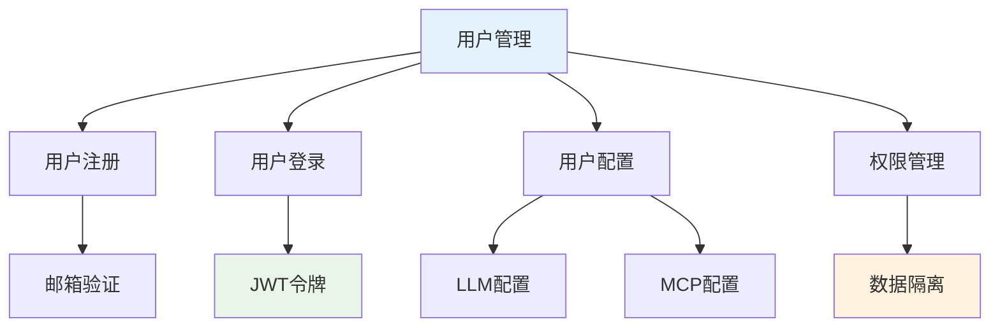

### 2. 对话管理模块
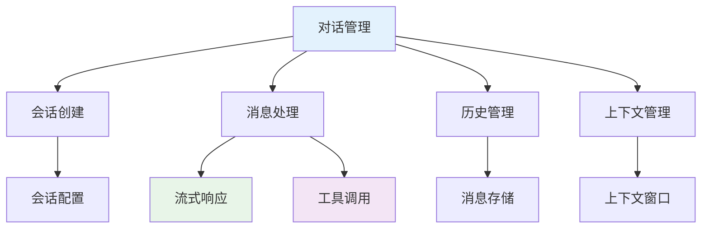

### 3. MCP工具模块
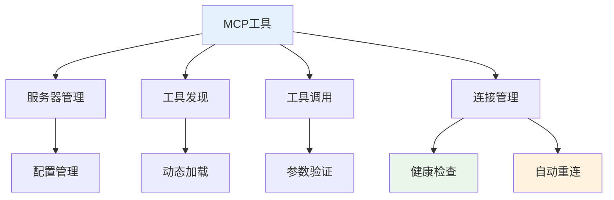

### 4. 知识库模块
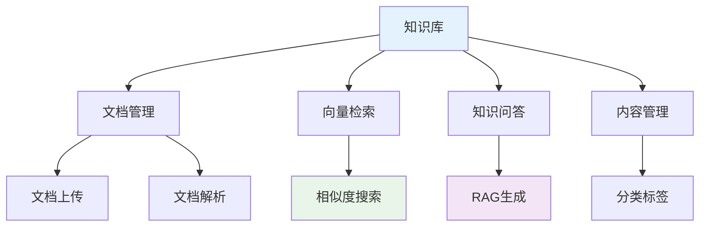

## 📊 数据流向分析

### 1. 用户数据流
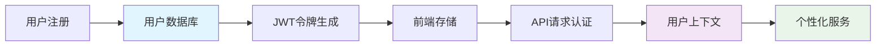

### 2. 对话数据流
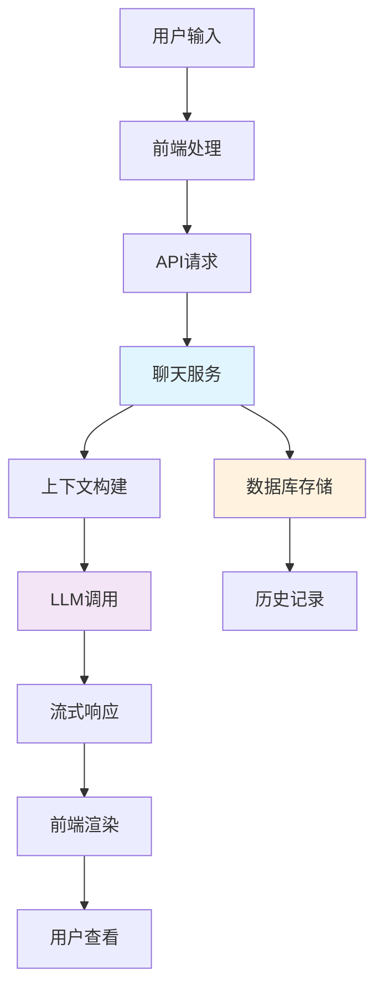

### 3. MCP数据流
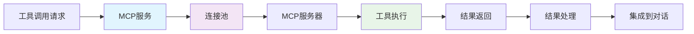

## 🚀 部署架构

### 1. 开发环境
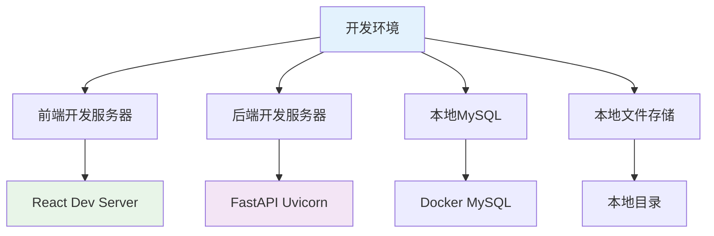

### 2. 生产环境
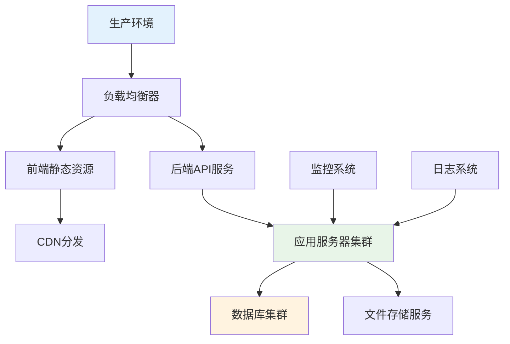

### 3. 容器化部署
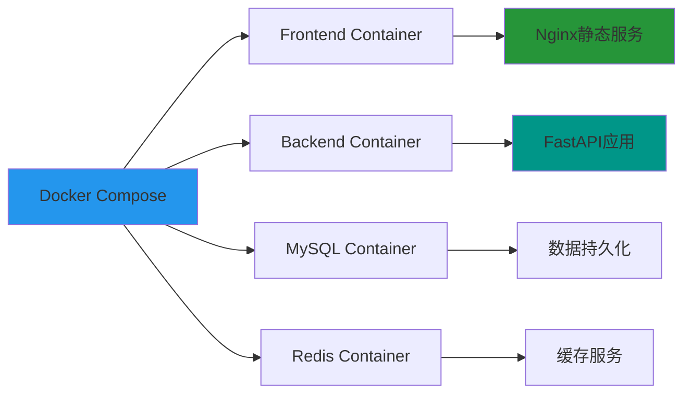

## 🔧 扩展性设计

### 1. 水平扩展能力
- **无状态设计**：API服务无状态，支持多实例部署

### 2. 功能扩展能力
- **插件化MCP**：支持自定义MCP服务器
- **API开放**：提供开放API供第三方集成
- **Webhook支持**：事件驱动的外部集成

### 3. 性能扩展能力
- **异步架构**：全异步处理，高并发支持
- **连接池**：数据库和外部服务连接复用
- **批处理**：批量操作优化性能
- **流式处理**：大数据流式处理能力

### 4. 安全扩展能力
- **多租户隔离**：完整的数据和权限隔离
- **API限流**：防止滥用的限流机制
- **审计日志**：完整的操作审计追踪
- **加密存储**：敏感数据加密存储

## 📈 性能指标

| 指标类型 | 目标值 | 当前状态 | 优化方向 |
|---------|--------|----------|----------|
| API响应时间 | < 200ms | ✅ 达标 | 缓存优化 |
| 流式响应延迟 | < 100ms | ✅ 达标 | 网络优化 |
| 并发用户数 | 1000+ | ✅ 支持 | 集群扩展 |
| 数据库查询 | < 50ms | ✅ 达标 | 索引优化 |
| MCP工具调用 | < 5s | ✅ 达标 | 超时控制 |
| 文件上传速度 | 10MB/s | ✅ 达标 | 分片上传 |

## 🎯 架构优势

### 1. 技术优势
- **现代化技术栈**：采用最新的技术和最佳实践
- **异步优先**：全异步架构，高性能表现
- **类型安全**：TypeScript + Pydantic双重类型保护
- **标准化协议**：MCP、OpenAPI等标准协议支持

### 2. 业务优势
- **用户体验**：流式响应，实时交互
- **功能丰富**：多模态AI能力集成
- **扩展性强**：插件化架构，易于扩展
- **安全可靠**：完整的安全和权限体系

这个架构设计确保了AI Template项目的**高性能**、**高可用**、**高扩展性**和**高安全性**，为用户提供优秀的AI助手服务体验。 